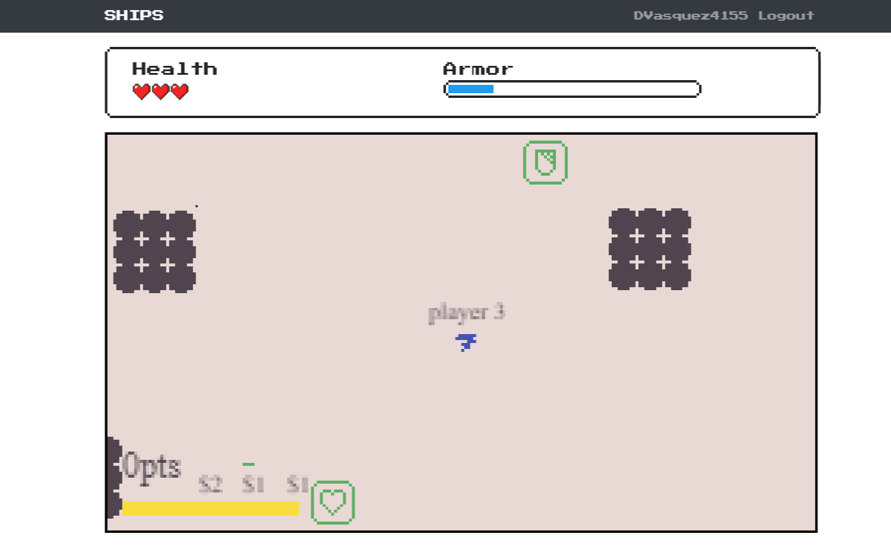

# Ships - Group Project 2

  

## Table of Contents

- [Installation](#Installation)
- [Usage](#Usage)
- [Credits](#Credits)
- [Contributing](#Contributing)
- [License](#License)

## Description

```
As a bored person at home during this quarantine with nothing to do but listen to our kids scream and ask for their 32nd snack of the afternoon praying for nap time to come. I need something to do. I need to let my frustrations out I need to blow shit up.

I give you Ships. The free to play game that kills useless time in the day that is simple user friendly and just plan fun. Fly around our world for an hour, 10 mins or your kids entire nap. It doesn't matter.


```

[](https://DVasquez4155.github.io/Group-Project-2)

## Installation

`npm i`

## Usage

`npm start`

## Credits

[ Daniel Vasquez Talavera](https://github.com/DVasquez4155) [ Kermit Bonner](https://github.com/krease23) [ Conrad](https://github.com/ConradRodgers) [ rafaelestradajr](https://github.com/rafaelestradajr) [ rusctzec](https://github.com/rusctzec) [ alfierr](https://github.com/alfierr)

## Contributing

This project has adopted the code of conduct defined by [Contributor Covenant](https://www.contributor-covenant.org/version/2/0/code_of_conduct/).

## License

Licensed under the [MIT License](https://choosealicense.com/licenses/mit/) license.
